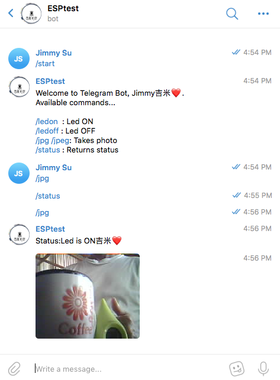
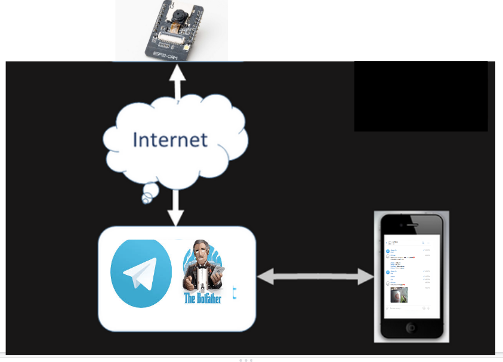

# ESP32-Cam-Telegram  
ESP32Cam w/ HTTP stream and Telegram
  

 &nbsp;&nbsp;&nbsp; 
  

## References
  - [Arduino Telegram Bot Library](https://github.com/witnessmenow/Universal-Arduino-Telegram-Bot) Telegrambot code at Github.
  - [ESP32Cam](https://github.com/espressif/esp32-camera) Espressif ESP32Cam code.
  - [Robot01 telegram tutor](https://robotzero.one/telegram-bot-esp32cam/) Running a Telegram Photo Bot on the ESP32-CAM.
